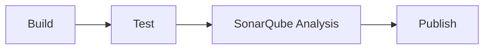

# sonarqube-prometheus-exporter

A Prometheus exporter for SonarQube project/portfolio business data --
quality gates, bugs, vulnerabilities, coverage, ratings, and analysis
recency -- that SonarQube's own native `/api/monitoring/metrics` endpoint
doesn't expose (that endpoint only covers server/process health: uptime,
queue depth, license, Elasticsearch, DB latency, etc.).

Built for and consumed by
[sonarqube-compose](https://github.com/rmrighes-sonar/sonarqube-compose)'s
Usage dashboard, but usable standalone against any SonarQube instance.

## Why this exists

Prometheus can only store what it scrapes as metrics. Per-project quality
data (quality gate status, issue counts, coverage, ratings) only exists via
SonarQube's regular Web API, which isn't Prometheus-formatted. Rather than
having Grafana call that API directly on every dashboard view (no caching,
no alerting story, dashboard availability coupled to SonarQube being
reachable *right now*), this exporter polls the Web API on its own schedule
and re-exposes the results as ordinary Prometheus metrics -- the same
pattern used by `mysqld_exporter`, `postgres_exporter`, `blackbox_exporter`,
etc.

It deliberately does **not** proxy SonarQube's native
`/api/monitoring/metrics` endpoint. That endpoint is already Prometheus-
native and purpose-built for direct scraping -- Prometheus should keep
scraping it directly (see `sonarqube-compose`'s `prometheus.yml`). This
exporter only owns the data that endpoint doesn't cover.

## Running

```
docker run --rm -p 9091:9091 \
  -e SONARQUBE_URL=http://sonarqube:9000 \
  -e SONARQUBE_API_TOKEN=your_token \
  ghcr.io/rmrighes-sonar/sonarqube-prometheus-exporter:latest
```

Then scrape/inspect `http://localhost:9091/metrics`.

### Configuration

| Env var | Default | Description |
|---|---|---|
| `SONARQUBE_URL` | `http://sonarqube:9000` | Base URL of the SonarQube instance to query. |
| `SONARQUBE_API_TOKEN` | _(none)_ | Bearer token. Needs Browse permission on the projects/portfolios to be charted. Generate via **My Account > Security > Generate Tokens**, or a dedicated read-only service account. |
| `LISTEN_ADDR` | `:9091` | Address the exporter's HTTP server listens on. |

### Building locally

`go build ./...` alone isn't enough to `docker build` anymore -- the
Dockerfile no longer compiles anything itself (see [CI/CD](#cicd) below),
it just copies in a prebuilt binary from `dist/linux/<arch>/`. Populate that
first, for your host's architecture:

```
go vet ./...
mkdir -p "dist/linux/$(go env GOARCH)"
GOOS=linux GOARCH="$(go env GOARCH)" CGO_ENABLED=0 \
  go build -trimpath -ldflags="-s -w" \
  -o "dist/linux/$(go env GOARCH)/sonarqube-prometheus-exporter" .
docker build -t sonarqube-prometheus-exporter .
```

### CI/CD

`.github/workflows/ci.yml` is a single workflow with four jobs chained via
`needs:` so the whole pipeline renders as one graph on the Actions run page:



**Build-once, reuse-everywhere** -- the Go compiler runs exactly twice total
per run (`build`'s cross-compile, `test`'s test-compile), and Docker never
compiles anything:

- **`build`** -- `go vet`, then cross-compiles static `linux/amd64` and
  `linux/arm64` binaries natively (Go's own cross-compiler, no QEMU needed)
  and uploads them as a build artifact.
- **`test`** (needs `build`) -- `go test -coverprofile=coverage.out`,
  uploads `coverage.out` as an artifact.
- **`sonarqube`** (needs `test`) -- downloads that coverage artifact and
  scans with it directly; **doesn't re-run the tests**. Requires
  `SONAR_TOKEN` (secret) and `SONAR_HOST_URL` (variable).
- **`publish`** (needs `build`, `test`, `sonarqube`; push to `main` only) --
  downloads `build`'s binaries and assembles the image via
  `docker buildx build`, whose Dockerfile only `COPY`s the right prebuilt
  binary per platform (no in-container compilation). Pushes
  `ghcr.io/rmrighes-sonar/sonarqube-prometheus-exporter:latest` and
  `:<git-sha>`. **Now gated on `sonarqube` passing** -- unlike before, a
  quality-gate failure blocks the image publish.

Both the `push` and `pull_request` triggers set
`paths-ignore: [CHANGELOG.md, .release-please-manifest.json]` --
release-please's Release PRs and their merge commits only ever touch those
two files, so this pipeline doesn't re-validate/re-scan/re-publish
something that already went through CI moments earlier under the real code
change -- see [Releases](#releases) below.

The GHCR package is private, matching this repo's visibility; pulling it
elsewhere requires `docker login ghcr.io` once with a token that has read
access.

**`main` is protected:** merging requires an open pull request with `build`,
`test`, and `sonarqube` all green (`publish` doesn't run on PRs, so it isn't
a required check), and direct pushes/force-pushes/deletion of `main` are
blocked. There's intentionally no required-approval count -- GitHub never
allows an account to approve its own pull request, and this repo has a
single maintainer, so requiring N approvals would make every PR permanently
unmergeable.

**Known bottleneck:** SonarQube here is self-hosted, reachable only through
`sonarqube-compose`'s `ngrok` tunnel. If that stack or tunnel isn't up when
CI runs, the `sonarqube` job fails -- and since it's a required check, that
blocks every merge to `main` (and every image publish) until the local
stack is back up.

### Releases

Versioning follows [Semantic Versioning](https://semver.org/), automated by
[release-please](https://github.com/googleapis/release-please) (see
`.github/workflows/release-please.yml`,
[release-please-config.json](release-please-config.json), and
[.release-please-manifest.json](.release-please-manifest.json)). To get a
correct version bump, commits to `main` must follow
[Conventional Commits](https://www.conventionalcommits.org/):

- `fix:` -- patch release (bug fix).
- `feat:` -- minor release (new feature, e.g. a new metric).
- `fix!:` / `feat!:` / a `BREAKING CHANGE:` footer -- major release (e.g. a
  removed or renamed Prometheus metric).
- `chore:`, `docs:`, `refactor:`, `test:`, `ci:` -- no release triggered on
  their own.

release-please maintains a standing "Release PR" that accumulates changes
since the last release; merging it cuts the actual git tag, GitHub Release,
and CHANGELOG.md entry. That same merge also triggers
`publish-release-image` in the same workflow, which adds semver tags --
`ghcr.io/rmrighes-sonar/sonarqube-prometheus-exporter:<version>`, `:<major>.<minor>`,
and `:<major>` -- onto the `:<git-sha>` image `ci.yml`'s `publish` job
already built and pushed for that exact commit. It does this via
`docker buildx imagetools create` (a manifest copy), not a rebuild -- the
code was already compiled, tested, scanned, and published seconds earlier
by `ci.yml`, so there's nothing to gain from recompiling it a second time
just to attach version tags. Pin to a `:<major>` or `:<major>.<minor>` tag
instead of `:latest` if you want a stable, intentionally-upgraded version in
`sonarqube-compose`'s `compose.yaml`.

## How it works

On every scrape (`/metrics` request), the exporter -- synchronously, no
background polling/caching -- calls:

- `GET /api/projects/search` -- discovers every project the token can see. No
  hardcoded project list; add/remove projects in SonarQube and they appear
  or disappear here automatically.
- `GET /api/components/search?qualifiers=VW` -- discovers portfolios
  (Enterprise/Governance only; returns an empty list, not an error, on
  other editions).
- `GET /api/measures/search` -- overall-code metrics, one call for all
  discovered projects/portfolios.
- `GET /api/measures/search` -- new-code metrics (via each measure's nested
  `period.value`), one call for all discovered projects.
- `GET /api/ce/activity` -- latest Compute Engine task per project, reduced
  to a last-analysis-status gauge (see Trade-offs below).

`/api/measures/search` is an internal/undocumented SonarQube endpoint (used
by SonarQube's own UI); if it breaks on a future upgrade, `/api/measures/component`
(one call per component) is the documented, stable fallback.

Metrics are emitted via `prometheus.MustNewConstMetric`, not a persistently
registered `GaugeVec` -- every scrape is a fresh snapshot, so a
project/portfolio deleted from SonarQube simply stops appearing on the next
scrape instead of leaving a stale series behind.

If any SonarQube API call fails mid-scrape, the exporter still returns a
valid (partial) `/metrics` response with `sonarqube_prometheus_exporter_up 0` and an
incremented `sonarqube_prometheus_exporter_scrape_errors_total`, rather than a 500 or a
crash.

## Metrics

All metrics are namespaced `sonarqube_project_*` / `sonarqube_portfolio_*`
-- distinct from SonarQube's own native `sonarqube_health_*` /
`sonarqube_compute_engine_*` / `sonarqube_license_*` metrics (scraped
separately, directly from SonarQube), so nothing collides.

### Per project (label: `project` = project key)

| Metric | Type | Notes |
|---|---|---|
| `sonarqube_project_info` | Gauge (always `1`) | Labels: `project`, `name`, `qualifier`, `visibility`, `revision`. Join via `* on(project) group_left(...)` wherever you need these as display labels. |
| `sonarqube_project_last_analysis_timestamp_seconds` | Gauge | Unix time of the last analysis. |
| `sonarqube_project_quality_gate_status` | Gauge | Labels: `project`, `status` (`OK`/`ERROR`/`WARN`/`NONE`). `1` for the current status, `0` for the others -- same convention as `kube_pod_status_phase`. |
| `sonarqube_project_bugs` / `_new_bugs` | Gauge | Overall / new-code bug count. |
| `sonarqube_project_vulnerabilities` / `_new_vulnerabilities` | Gauge | Overall / new-code vulnerability count. |
| `sonarqube_project_security_hotspots` | Gauge | |
| `sonarqube_project_code_smells` | Gauge | |
| `sonarqube_project_coverage_percent` / `_new_coverage_percent` | Gauge | 0-100. |
| `sonarqube_project_duplicated_lines_percent` | Gauge | 0-100. |
| `sonarqube_project_lines_of_code` | Gauge | `ncloc`. |
| `sonarqube_project_reliability_rating` / `_security_rating` / `_maintainability_rating` | Gauge | 1 (A) to 5 (E), matching SonarQube's own numeric convention. |
| `sonarqube_project_last_analysis_status` | Gauge | Labels: `project`, `status` (`SUCCESS`/`FAILED`/`CANCELED`). From the most recent Compute Engine task. |

New-code metrics are only present once a project has a defined "new code
period" and a prior analysis to diff against -- absent rather than `0` if
not yet applicable, so they're never a false signal.

### Per portfolio (label: `portfolio` = portfolio key; Enterprise/Governance only)

Mirrors the project set minus new-code and hotspot/last-analysis-status
metrics (SonarQube's portfolio-level API doesn't expose those):
`sonarqube_portfolio_info`, `_quality_gate_status`, `_bugs`,
`_vulnerabilities`, `_coverage_percent`, `_duplicated_lines_percent`,
`_lines_of_code`, `_reliability_rating`, `_security_rating`.

### Exporter self-health

| Metric | Type |
|---|---|
| `sonarqube_prometheus_exporter_up` | Gauge, `1`/`0` |
| `sonarqube_prometheus_exporter_scrape_duration_seconds` | Gauge |
| `sonarqube_prometheus_exporter_scrape_errors_total` | Counter |

## Trade-offs

- **No history backfill.** Trend data only exists from whenever Prometheus
  starts scraping this exporter onward -- there's no equivalent of
  SonarQube's own `search_history` API backfill.
- **CE event log becomes a status gauge, not a log.** The raw "last N
  analyses with exact timestamps/durations/error messages" list doesn't
  cleanly become fixed-cardinality metrics; only the latest status per
  project is exposed. If you need the full event log, query
  `/api/ce/activity` directly instead of via this exporter.
